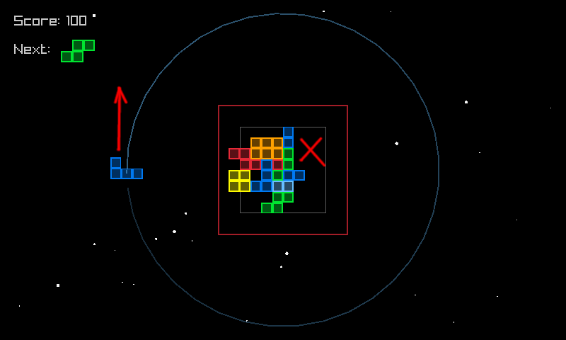
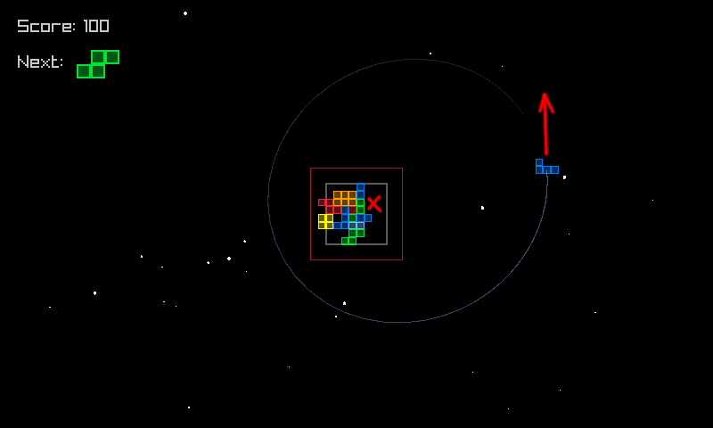

# Orbitris

### Version of Tetris with some *SPIN* to it.

Coded for Ludum Dare 49 in 48h

## [Play on itch.io](https://catinthedark.itch.io/orbtris)
## [Entry on ldjam.com](https://ldjam.com/events/ludum-dare/49/orbitris)

### Controls

* **A/D** (Left/Right arrows): Rotate piece
* **W** (Up arrow): Accelerate
* **S** (Down arrow): Decelerate

### How to play

Place tetraminos just like in normal Tetris. Any row or column will disappear, if you fill it up to the GREY square. Fun thing is that sometimes you can score more than 4 lines at once!

If any block sticks out of RED square bounds, it’s a game over!

### Tips & Tricks

Gameplay might seem hard for someone due to counter-intuitivety of the orbital mechanics. Using this simple trick, you can aim your pieces precisely! (I wanted to add this help into the game, but ran out of time):

1) Select the position where you want to put your next piece, and ACCELERATE to raise your orbit above this position

2) When your piece is above the desired position, DECELERATE: tut2.png

3) And it's done!

### Changelog

* 10.10.2021:
  - Fix fullscreen

### Used resources:

* [Raylib](https://github.com/raysan5/raylib) as the game library
* [Tetris wiki](https://tetris.fandom.com/) - for info on Tetris in general, e.g. SRS (Standard Rotation System), default pieces colors, scores in classic Tetris, etc.
* [This article](https://evgenii.com/blog/earth-orbit-simulation/) for the orbital mechanics algorithm
